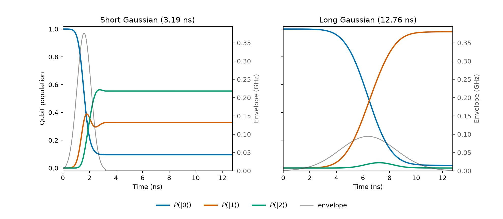
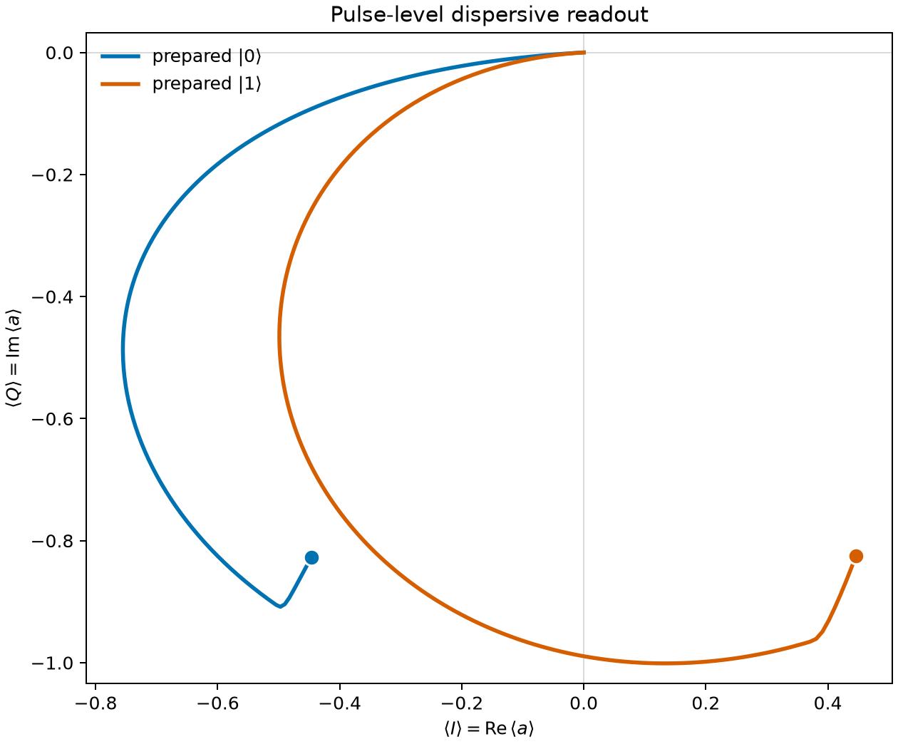

<p align="center">
  <picture>
    <source media="(prefers-color-scheme: dark)" srcset="https://quchip.org/assets/quchip-wordmark-dark.png">
    <source media="(prefers-color-scheme: light)" srcset="https://quchip.org/assets/quchip-wordmark-light.png">
    
  </picture>
</p>

`quchip` is an open-source Python toolkit for modeling superconducting quantum chips.

A predictive chip model needs more than a Hamiltonian: device physics, control-line transformations, frames and approximations, dissipation, and measured observables all belong to it. quchip represents each part explicitly. Line properties such as gain, delay, and crosstalk belong to the control chain, not to Hamiltonian terms written by hand.

Declare the chip once. The same declaration drives dressed-state analysis, model reduction, control sequencing, open-system simulation, parameter sweeps, and exact JAX gradients. The engine resolves each device's frame, applies the requested approximations, and records the bands it drops.

QuTiP is the default backend. The dynamiqs backend is JAX-native and keeps declared device and control parameters differentiable through the solve.

`quchip` uses GHz for ordinary frequencies, ns for time, and mK for temperature. The implemented conventions and approximations are recorded in [PHYSICS.md](PHYSICS.md).

## Install

`quchip` requires Python 3.11 or newer. Install the current source:

```bash
git clone https://github.com/quchip/quchip.git
cd quchip
python -m pip install .
```

Optional extras are available for the dynamiqs backend, graph visualization, scqubits interoperability, tests, and development:

```bash
python -m pip install '.[dynamiqs]'
python -m pip install '.[viz]'
python -m pip install '.[scqubits]'
```

Extras can be combined in one install.

## A minimal chip

```python
from quchip import Capacitive, ChargeDrive, Chip, DuffingTransmon, Resonator

qubit = DuffingTransmon(freq=5.0, anharmonicity=-0.30, levels=6, label="qubit")
readout = Resonator(freq=6.8, levels=10, quality_factor=6800, label="readout")
coupling = Capacitive(qubit, readout, g=0.060, rwa=True, label="qubit-readout")
chip = Chip([qubit, readout], couplings=[coupling], frame="rotating", rwa=True)
qubit_line = ChargeDrive(qubit, label="qubit-charge")
readout_line = ChargeDrive(readout, label="readout-charge")
chip.wire(qubit_line, readout_line)

f01 = chip.freq(qubit)
f12 = chip.freq(qubit, when={qubit: 1})
fr0 = chip.freq(readout, when={qubit: 0})
fr1 = chip.freq(readout, when={qubit: 1})
```

The complete example derives short and selective nominal-pi Gaussian drives from $|f_{12}-f_{01}|$, then derives a Gaussian-edge readout duration from the conditional pull and resonator linewidth. Both parts run the real multilevel, lossy chip with compact reproducibility receipts.





The complete walkthrough is available as [authored Markdown](examples/00_hello_chip.md) and an [executed notebook](examples/00_hello_chip.ipynb).

## Tests

Install the dependencies used by all shipped test lanes:

```bash
python -m pip install -e '.[test,dynamiqs]'
```

Run the full suite:

```bash
python -m pytest
```

Run one lane:

```bash
python -m pytest -m core
python -m pytest -m physics_sentinel
python -m pytest -m extended
```

## Examples

- [Hello, drive and readout](examples/00_hello_chip.md): compare qubit-drive leakage, then resolve pulse-level dispersive readout on the same chip.
- [Cookbook](docs/cookbook.md): practical conventions and task recipes.

## Paper and citation

The accompanying paper is [quchip: A Differentiable Toolkit for Modeling Quantum Devices](https://arxiv.org/abs/2607.17081) (arXiv:2607.17081).

If you use quchip in your work, please cite it:

```bibtex
@misc{alyousef2026quchip,
      title={quchip: A Differentiable Toolkit for Modeling Quantum Devices},
      author={Ibraheem AlYousef},
      year={2026},
      eprint={2607.17081},
      archivePrefix={arXiv},
      primaryClass={quant-ph},
      doi={10.48550/arXiv.2607.17081},
      url={https://arxiv.org/abs/2607.17081},
}
```

Citation metadata for the software itself is in [CITATION.cff](CITATION.cff).

## License

`quchip` is distributed under the Apache License 2.0. See [LICENSE](LICENSE).
