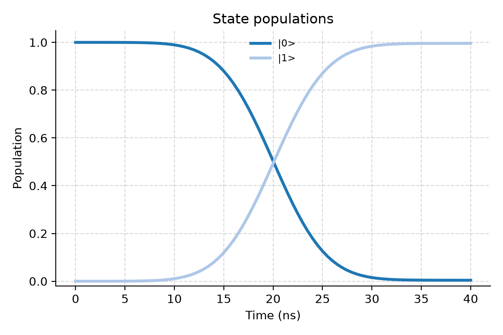

<p align="center">
  <picture>
    <source media="(prefers-color-scheme: dark)" srcset="docs/images/quchip-wordmark-dark.png">
    
  </picture>
</p>

`quchip` is an open-source Python toolkit for modeling superconducting quantum chips.

A predictive chip model needs more than a Hamiltonian: device physics, control-line transformations, frames and approximations, dissipation, and measured observables all belong to it. quchip represents each part explicitly. Line properties such as gain, delay, and crosstalk belong to the control chain, not to Hamiltonian terms written by hand.

Declare the chip once. The same declaration drives dressed-state analysis, model reduction, control sequencing, open-system simulation, parameter sweeps, and exact JAX gradients. The engine resolves each device's frame, applies the requested approximations, and records the bands it drops.

QuTiP is the default backend. The dynamiqs backend is JAX-native and keeps declared device and control parameters differentiable through the solve.

`quchip` uses GHz for ordinary frequencies, ns for time, and mK for temperature. The implemented conventions and approximations are recorded in [PHYSICS.md](PHYSICS.md).

## Install

`quchip` requires Python 3.11 or newer. Install the current source:

```bash
git clone https://github.com/Quchip/quchip.git
cd quchip
python -m pip install .
```

Optional extras are available for the dynamiqs backend, graph visualization, scqubits interoperability, tests, and development:

```bash
python -m pip install '.[dynamiqs]'
python -m pip install '.[viz]'
python -m pip install '.[scqubits]'
```

Extras can be combined in one install.

## A minimal chip

```python
import numpy as np
from quchip import Capacitive, ChargeDrive, Chip, DuffingTransmon, Gaussian, QuantumSequence, Resonator

qubit = DuffingTransmon(freq=5.24, anharmonicity=-0.26, levels=3)
readout = Resonator(freq=6.65, levels=4)
chip = Chip([qubit, readout], couplings=[Capacitive(qubit, readout, g=0.060)], frame="rotating")
drive = ChargeDrive(qubit)
chip.wire(drive)
sequence = QuantumSequence(chip)
sequence.schedule(drive, envelope=Gaussian(duration=40.0, amplitude=0.030), freq=chip.freq(qubit))
result = sequence.simulate(
    tlist=np.linspace(0.0, 40.0, 81),
    initial_state=chip.state({qubit: 0, readout: 0}),
    e_ops={qubit: qubit.projector(1, 1)},
)
print(float(result.expect_final(qubit).real))

fig = result.plot_populations(trace_out=readout)
fig.savefig("populations.png", dpi=200)
```

The pulse carrier comes from the dressed chip frequency. The printed value is the excited-state population after a nominal π pulse. The last two lines plot the qubit populations with the readout resonator traced out. The figure below is the saved output of the snippet.



## Tests

Install the dependencies used by all shipped test lanes:

```bash
python -m pip install -e '.[test,dynamiqs]'
```

Run the full suite:

```bash
python -m pytest
```

Run one lane:

```bash
python -m pytest -m core
python -m pytest -m physics_sentinel
python -m pytest -m extended
```

## Examples

Worked examples are being added incrementally.

## Paper and citation

Paper reference: pending.

Citation metadata: pending.

## License

`quchip` is distributed under the Apache License 2.0. See [LICENSE](LICENSE).
